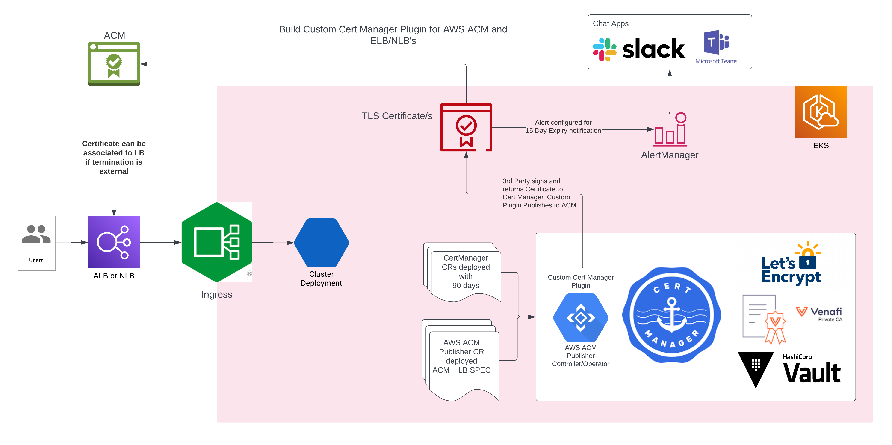

## aws-acm-syncer
[](https://github.com/microscaler/aws-acm-syncer/actions/workflows/ci.yml)

A kubernetes controller for certificates generated by CertManager and Synced to AWS ACM. 

This controller is useful when you want to use AWS ACM to manage certificates for your kubernetes cluster.

The controller will:
- watch for certificates generated by CertManager.
- upload generated certificates to AWS ACM under configured domain name.
- update the certificate status with the ARN of the certificate in AWS ACM.
- update load balancers in AWS to use the certificate in AWS ACM for the configured domain name.
- update ingress resources to use the certificate in AWS ACM for the configured domain name.

On completion of development the controller will be donated to CNCF Cert Manager project for on going maintenance.

# Highlevel Architecture



### Cluster
As an example; get `k3d` then:

```sh
k3d cluster create --registry-create --servers 1 --agents 1 main
k3d kubeconfig get --all > ~/.kube/k3d
export KUBECONFIG="$HOME/.kube/k3d"
```

A default `k3d` setup is fastest for local dev due to its local registry.

### CRD
Apply the CRD from [cached file](yaml/crd.yaml), or pipe it from `crdgen` (best if changing it):

```sh
cargo run --bin crdgen | kubectl apply -f -
```

### Locally

```sh
cargo run
```

or, with optional telemetry (change as per requirements):

```sh
OPENTELEMETRY_ENDPOINT_URL=https://0.0.0.0:55680 RUST_LOG=info,kube=trace,controller=debug cargo run --features=telemetry
```

### In-cluster
Use either your locally built image or the one from dockerhub (using opentemetry features by default). Edit the [deployment](./yaml/deployment.yaml)'s image tag appropriately, and then:

```sh
kubectl apply -f yaml/deployment.yaml
kubectl wait --for=condition=available deploy/doc-controller --timeout=20s
kubectl port-forward service/doc-controller 8080:80
```

To build and deploy the image quickly, we recommend using [tilt](https://tilt.dev/), via `tilt up` instead.

**NB**: namespace is assumed to be `default`. If you need a different namespace, you can replace `default` with whatever you want in the yaml and set the namespace in your current-context to get all the commands here to work.
